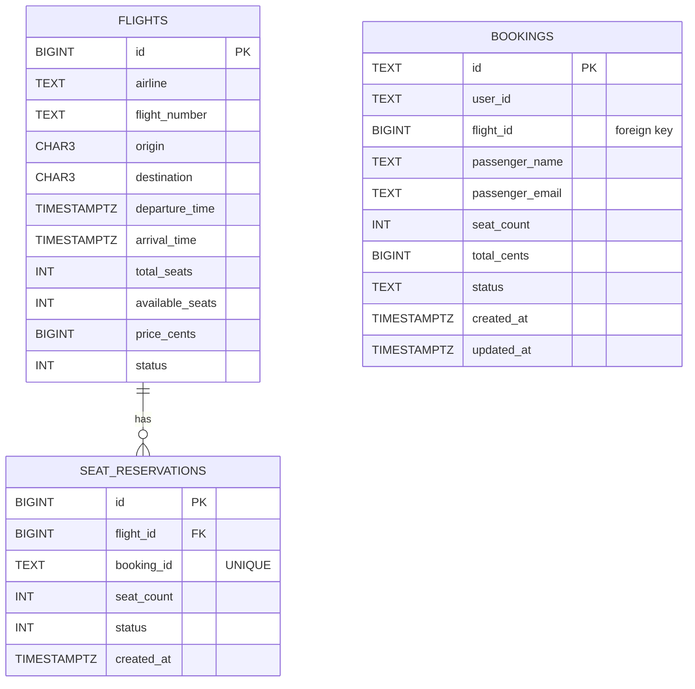

```mermaid
erDiagram
    FLIGHTS ||--o{ SEAT_RESERVATIONS : has
    FLIGHTS {
        BIGINT id PK
        TEXT airline
        TEXT flight_number
        CHAR3 origin
        CHAR3 destination
        TIMESTAMPTZ departure_time
        TIMESTAMPTZ arrival_time
        INT total_seats
        INT available_seats
        BIGINT price_cents
        INT status
    }
    SEAT_RESERVATIONS {
        BIGINT id PK
        BIGINT flight_id FK
        TEXT booking_id "UNIQUE"
        INT seat_count
        INT status
        TIMESTAMPTZ created_at
    }

    BOOKINGS {
        TEXT id PK
        TEXT user_id
        BIGINT flight_id "foreign key"
        TEXT passenger_name
        TEXT passenger_email
        INT seat_count
        BIGINT total_cents
        TEXT status
        TIMESTAMPTZ created_at
        TIMESTAMPTZ updated_at
    }
```